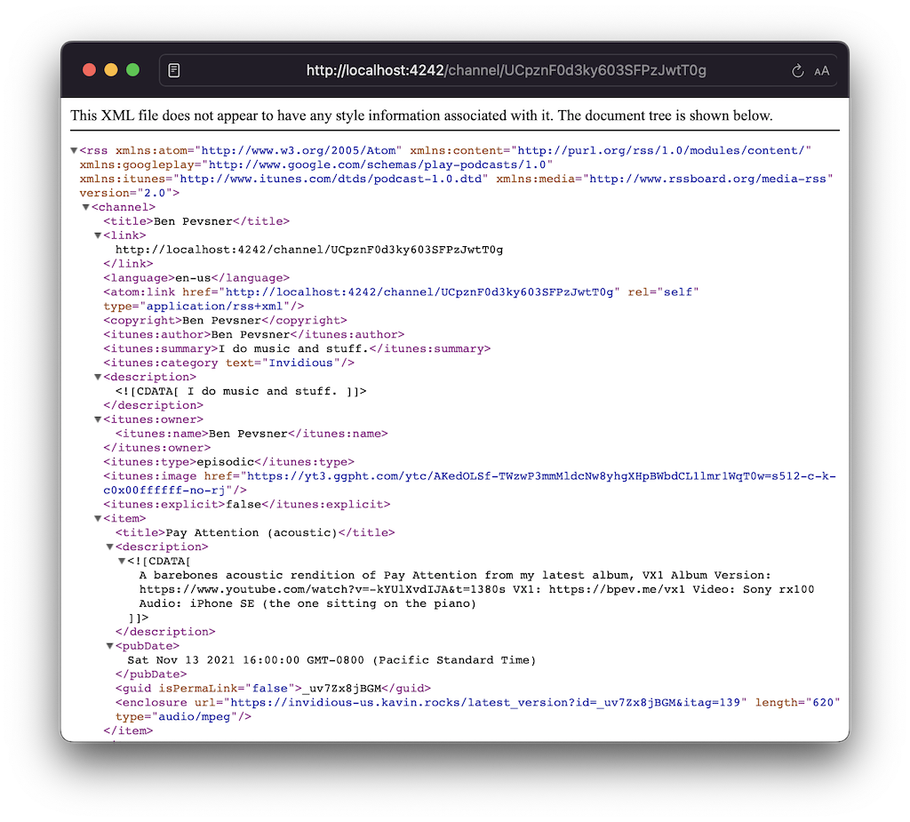

# Invidious Podcasts

A server that returns a podcast rss feed for an invidious channel id.

Please do not use this script to publish public feeds for channels you do not own.

## Usage

invidious_podcasts expects Deno to be installed, and will make webrequests to specified Invidious instance(s).

**Clone Repo**

```sh
# Create env file, and update to whatever instance you want to use
cp apps/podcasts/.env.example apps/podcasts/.env
nano apps/podcasts/.env

# Start server on http://localhost:8000
deno run --allow-net --allow-env --allow-read ./apps/podcasts/main.ts

# You can now make requests to the server
curl http://localhost:8000/channel/UCpznF0d3ky603SFPzJwtT0g
```

You can then add your url to any podcast app that accepts urls. Keep in mind that most services don't make direct podcast fetches from your machine, so you will likely need to host this somewhere (or host on a public port).


